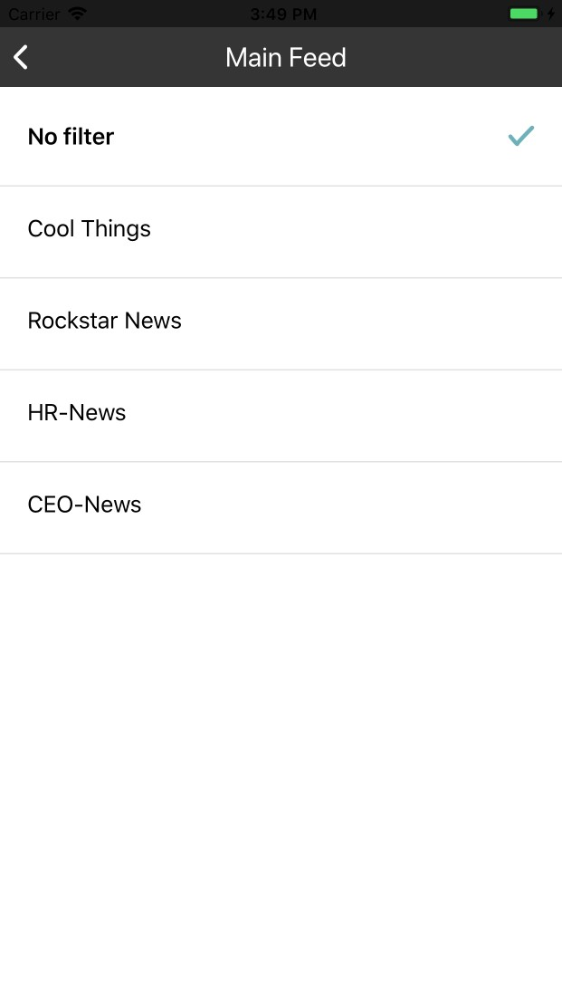

.. _main_feed:

====================
Main Feed
====================

This is the main screen after you login. All posts which are shared with you will be displayed on main feed.

#. Filter bar
#. Tab bar
#. Posts
#. Instant update

1. Filter bar
-----------------------------
.. figure:: ../Resources/Images/Default_Filter_Bar.jpg
   :alt: Filter Bar
   :scale: 50 %

Main feed shows all posts by default. User can select to show post in single category.
To open category list, click on filter button.

The dialog will be closed after user select category. Main feed screen now shows post in seleced category. The text in filter bar will be catetory name.

.. figure:: ../Resources/Images/Filter_MainFeed.jpg
   :alt: Filter Main Feed
   :scale: 50 %

The filter bar  also indicates searching string which is used to search tags in search screen.
User can clear search result by clicking on search string  in filter bar or selecting any item in filter dialog.  

2. Tab bar 
-----------------------------
.. figure:: ../Resources/Images/TabBar.jpg
   :alt: Tab bar
   :scale: 50 %

This is main navigation bar in application. User can navigation to other screens. The corresponding icon is highlight when navigate to screen.
Tab tab also show number of unread notification. 

When user is at screens contain list of post such as main feed or profile, user can scroll up by double-click on corresponding icon.

3. Posts 
-----------------------------

- Scroll up to load older post.If there aren't post in cache, application will get data from server, the loading icon will be show and dismiss when loading finish.
- Scroll down at begin of list to refresh list and load new posts.

4. Instant update
------------------------------

When someone likes or comments on your post, you will receive notification and that's post will be updated immedieatly.

