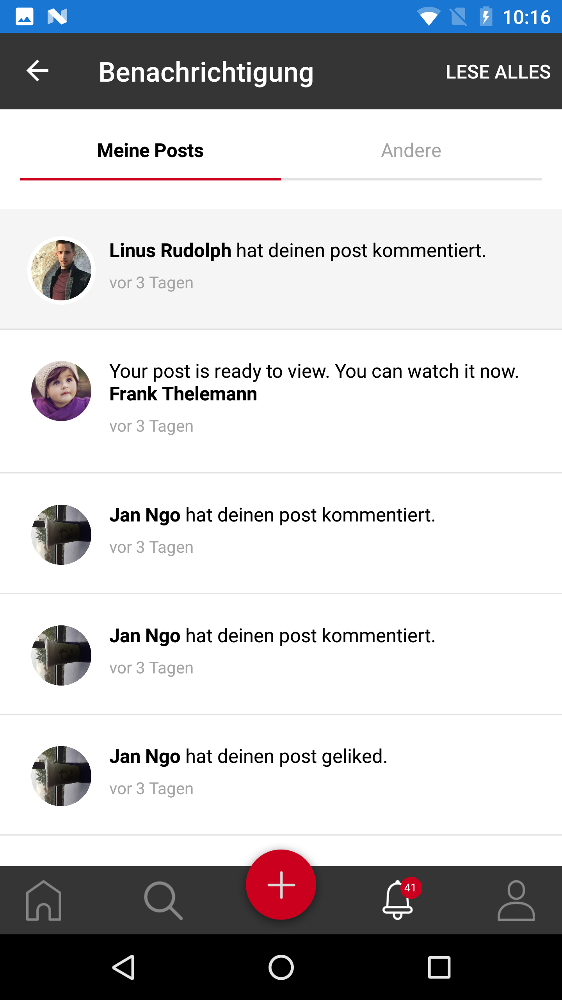

.. _notification:

====================
Notification 
====================

This screen contain all user notifications.

(1) When click on notification:
    - If post-related notification: app will open that post. 
    In case user is removed from group which is shared with or owner update post, popup will show to notify user.

(2) Update notification: app will check app update, user will receive corresponding information.

