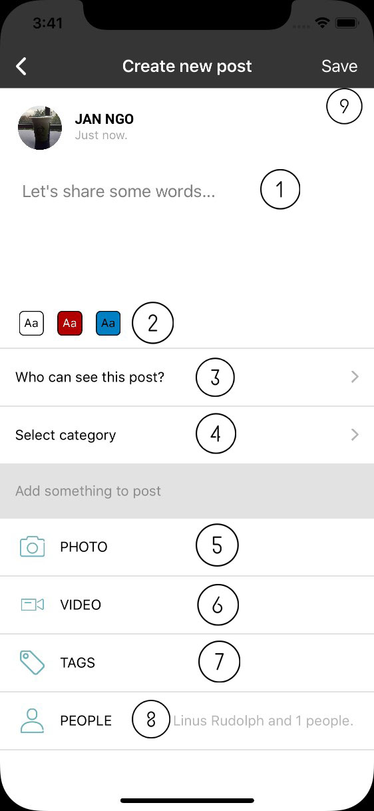
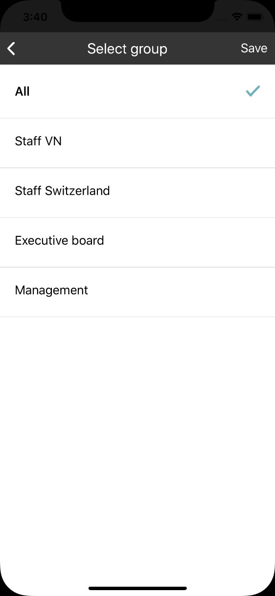
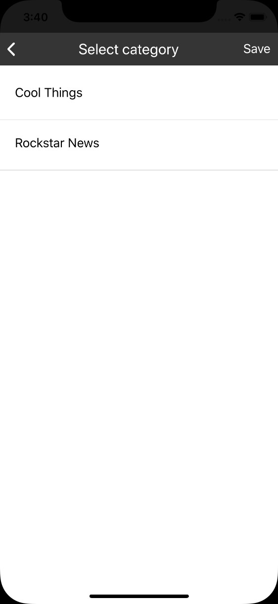
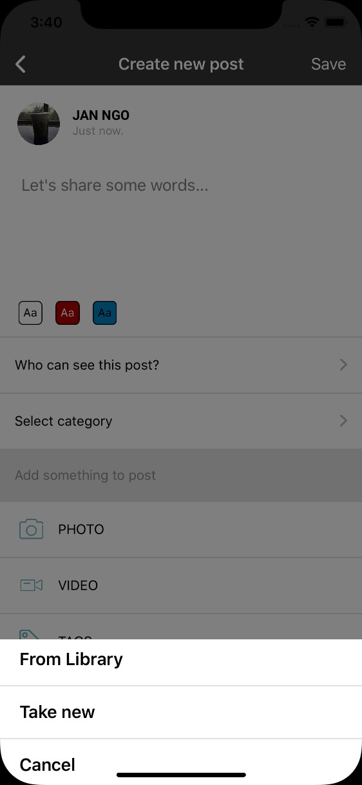
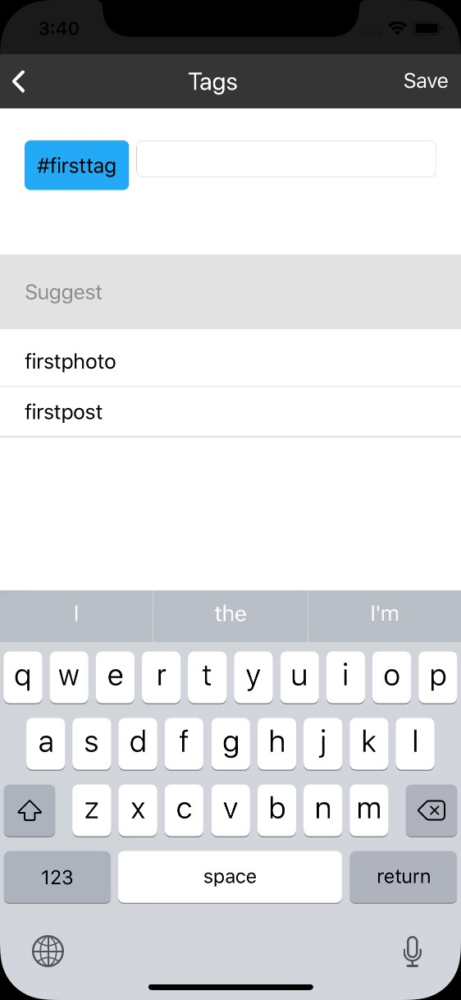
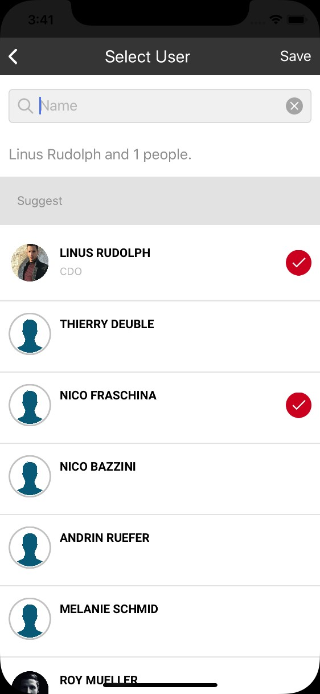

.. _create_post:

====================
Create post
====================

(1) Text input: support multilines.

(2) Background list: post background style. User can select background color. 
    Select first option to use default (no background, black text)
    This option is not available when image/video is add into post. 
    In case user choose background then add image/video, background will be reset to default.

(3) Sharing group: user can select one or many groups to share post with. Default is shared all groups.

(4) Select catetory: select post catetory. App only show catetories which user has permision to add post into.

(5) Add photo to post. Maximum 10 photos, 10mb per pic. User can either select image in library or take new.

(6) Add video to post. Maximum 3 video, 100 per video.

(7) Tag: click on this line to open tag dialog.Input text and press space to add new tags. 
App will search exist tag in system and show on the list. User can add or remove tag by select item on the list.

(8) People: select single person or people to mention in post. User can only select people in group which are shared with.

(9) Save post: if post only contain text or share post, the post is visible immedieatly after save post successfully. 
    In case post has video/image, the system takes time to process. User will receive notification when post is ready.
    In both case, toast message will be show to notify user.

