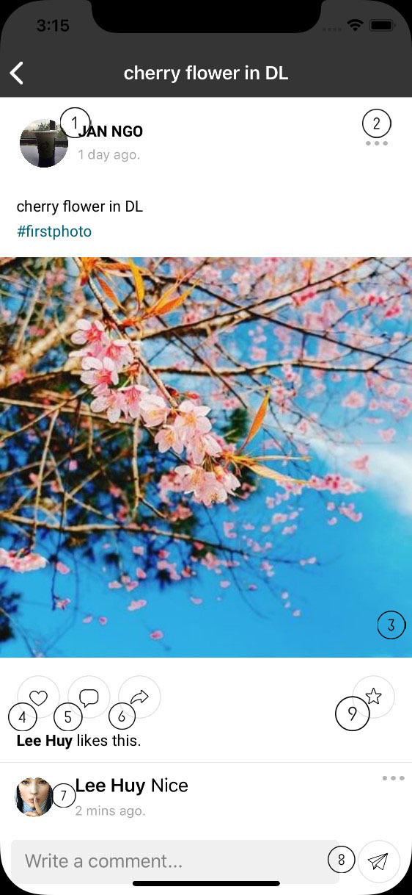
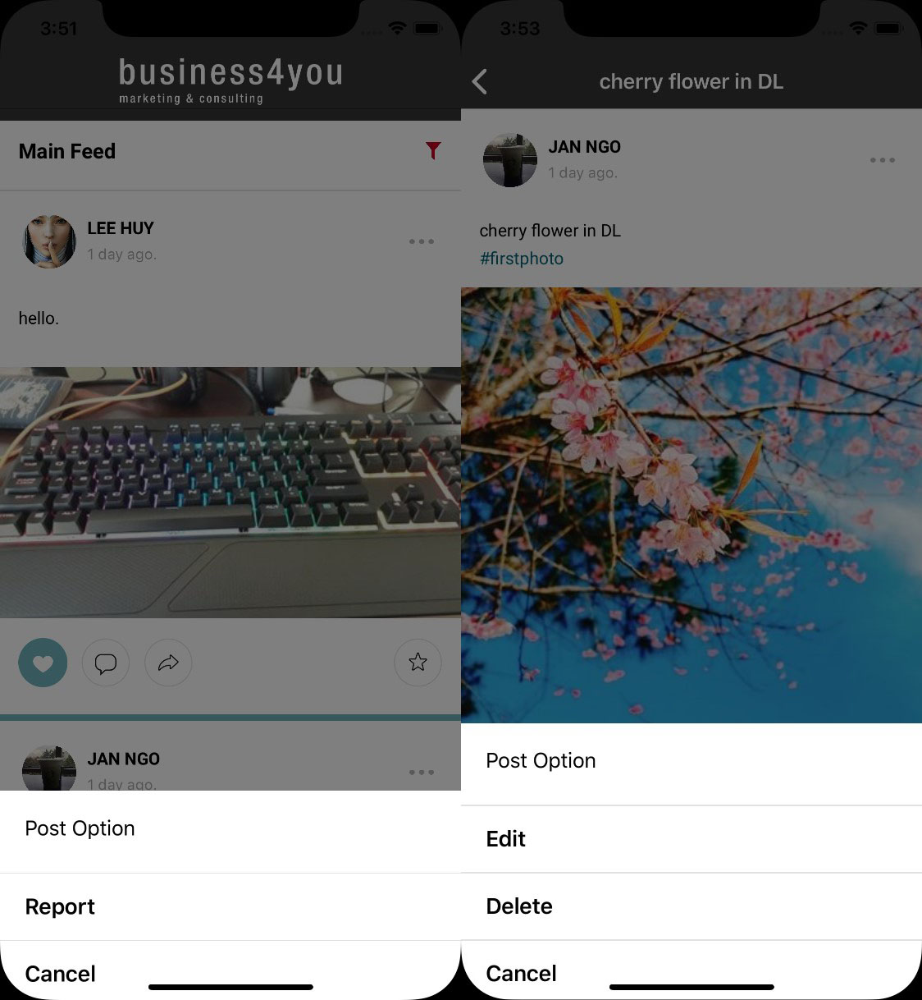

.. _post_detail:

====================
Post detail
====================
Show post content, include comment,interaction.

(1) Post info: user who creates post and time. When clicks on avatar or name, app will navigate to that person's profile.
(2) Context menu: click on that button to open context menu. Menu is different between owner and others.

(3) Post Content: post content can be text, image, video or share post. 
  - Image/Video: when user click on image/video, dialog is open to show high quality image or video.
  - Sharing post: app will show that post by detail.

(4) Like post
(5) Open keyboard. When user clicks on this button in main feed screen or profile screen, app will navigate to post detail page and open keyboard.
(6) Share post: app will navigate to create post screen with this post .
(7) Comments list: list of comment. User can open person who commented by clicking on avatar.
(8) Comment input: allow user to add new comment. Support multi-lines.
(9) Saved button: bookmark post. Button will be changed to blue when post is bookmarked.
