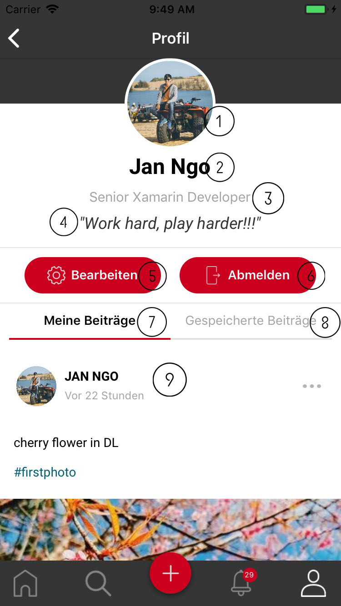
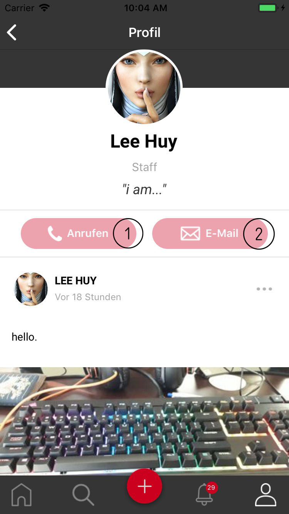

.. _profile:

====================
Profile
====================
There are two kind of profile page : your profile and other.

.. figure:: ../Resource/Images/Profile_Overview.jpg
   :alt: Profile Screen
   :scale: 50 %

.. toctree::
	:maxdepth: 2

	EditProfile

#. Your Profile
#. Other's Profile

1. Your profile
-----------------------------

This screen shows all infomation belong to user.
 (1) Profile picture.
 (2) Fullname
 (3) Position: user can update position description in editting profile page.
 (4) Your sharing status.
 (5) Edit profile button: navigate to editting profile page.
 (6) Logout button: log out of application.
 (7) Tab shows all your posts.
 (8) Tab shows all your saved posts.
 (9) Post list.

2. Other's profile
-----------------------------

This screen is similiar to your profile page.
 (1) Call button: show list of phone number if user have more than 1 number or open dial panel.
 (2) Email button: show list of email address if user have more than 1 number or open email app.

