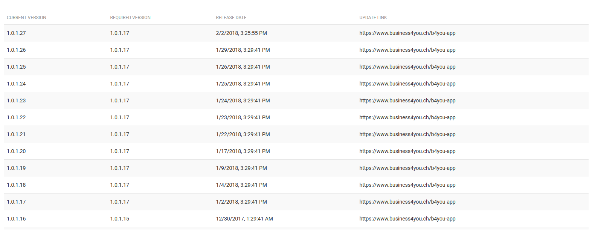
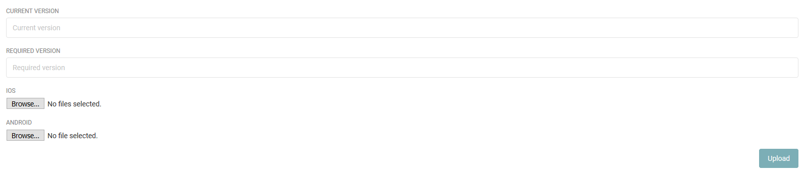

==================
Aplication version
==================

When release new version for mobile application. Administrator will upload it to server, user can download new version and continues use it.

App-verion history list
----------------------------

The list of version.

Upload new release
--------------------

The administrator have to add new version and select the installation file for android and ios. Then upload it to server