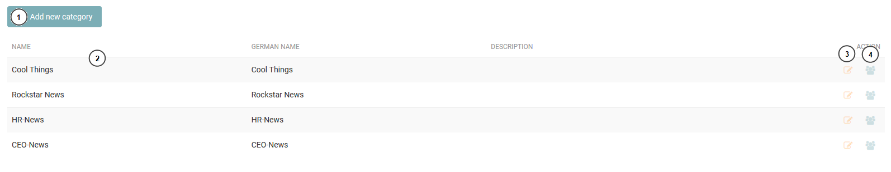
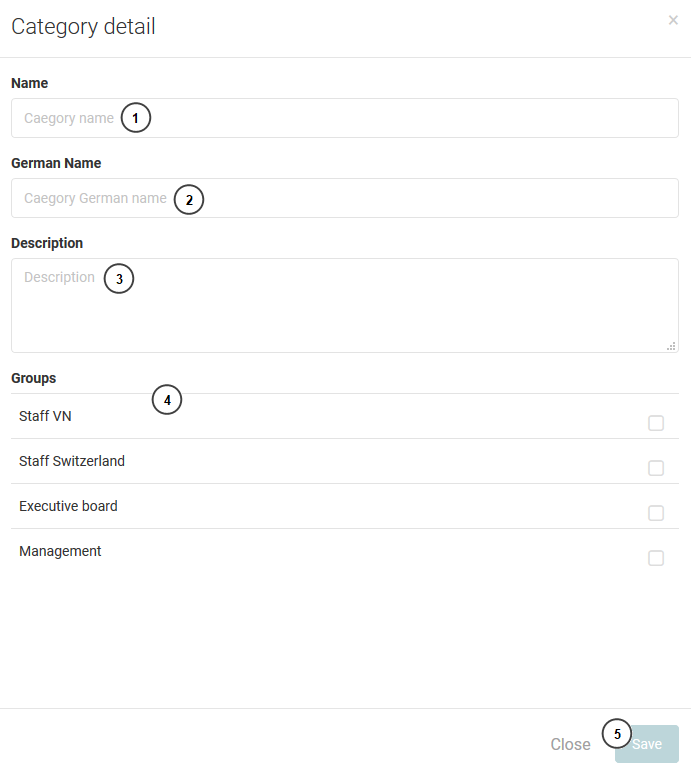
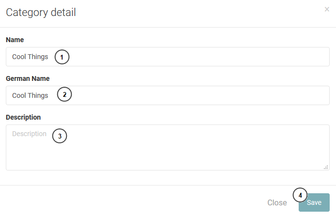
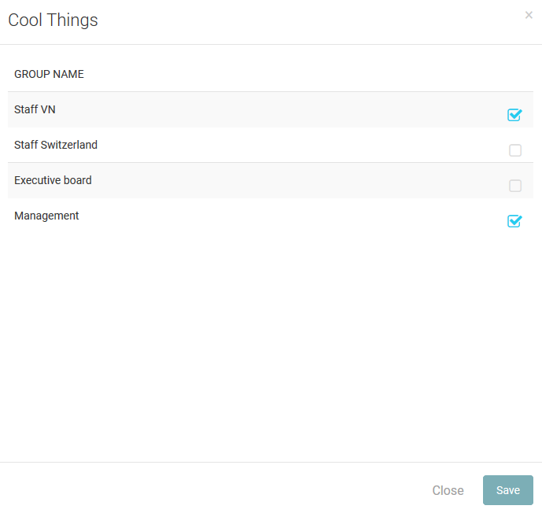

========
Category
========

Category list
--------------

The list show all category of the application. 

#. Add new category.
#. The category list.
#. Edit category.
#. Assign category to a group or many group.

Create new category
---------------------------

The administrator fill all infomation and select group to create new category.

#. Category name.
#. German name.
#. Description.
#. Group list.
#. Save button

Edit category
--------------------

#. Category name.
#. German name.
#. Description.
#. Save button.

Assign group.
------------------

The administrator just select the group for category and save.

