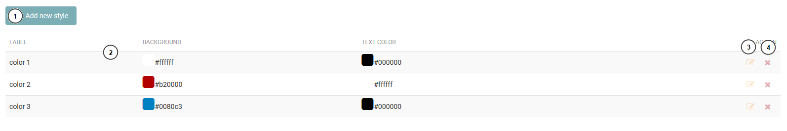
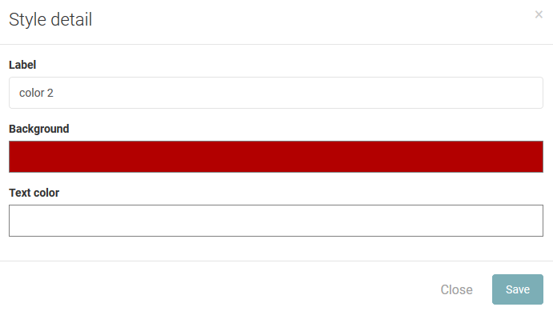
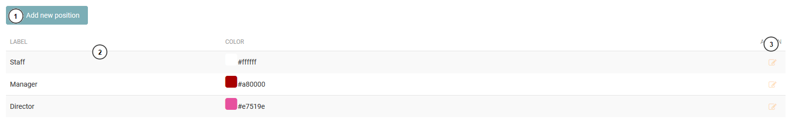
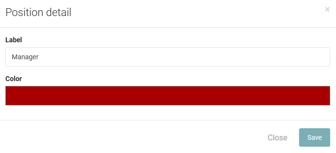

=============
Configuration
=============

Style
-----------------

When user create new post, they can select a style for a post. The style include backgroud and text color.

#. Add new style.
#. the list of style.
#. Edit style.
#. Delete a style.

Create/Edit a sytle.

The administrator can name a style, change the backgroud color or text color.

Position
---------------

Each user has a position. Each position, it has difference color. The color will show in the mobile application.

#. Add new style.
#. The list of position.
#. Edit position.

Create/Edit a position

The administrator can name a position and change the backgroud color..