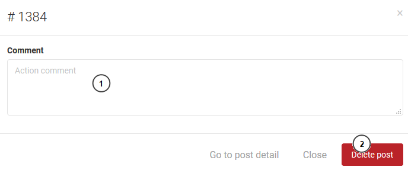

===========
Dashboard
===========

Dashboard show all the system infomations with short content. So that, the user can have the overview about all data of system.

Post in 24h Section
----------------------

This section show all the post of 24h. The user can review the post's content, the reported post and who create the post. So, they will have the action for the post or ignore it.

#. The reported indicator. If the posts have bad content, and someone report the posts, the indicator will be showed to indicate to administrator see and have the action with the posts.
#. Show report button. The button will be showed when the post has been reported by the user. The administrator can take a look at the content of the report.
#. The administrator can see all of content of the post.
#. Delete button. The administrator can delete the post.

1. Report view

#. The reporter list and content of reports.
#. The administrator can write a reason when they do an action (mark as review or delete the post) .
#. Administrator can view the detail by "Go to post detail" button.
#. Close report view form.
#. If there is no bad content, administrator can mark it as viewed and the report wont show again.
#. After review the post, if there is a bad content, administrator can delete it.

2. Detail view

#. Content detail.
#. Go to report view.
#. Go to delete view.

3. Delete view

#. Administrator can leave comment when they delete a post.
#. Delete button.