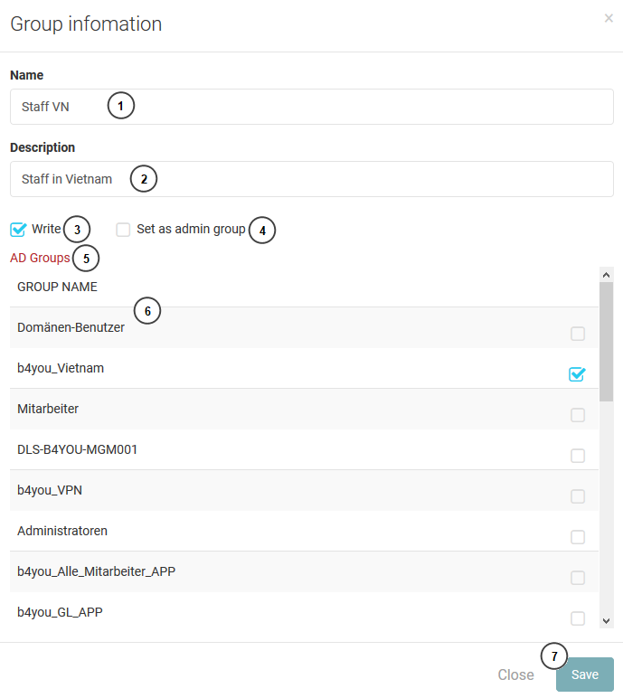

=====
Group
=====

Group list
---------------------

This is a list of group in system. The administrator can create, delete or edit a group.

#. Add new group button.
#. The list of avaiable group.
#. Deleted groups.
#. Edit group infomation.
#. Delete group button.

Create/Edit a group

If the application need to has more or change a group infomation, administrator can create or edit the group.

#. The name of group.
#. Description.
#. The privilege of the group. If the group do not have write privilege. The user belong to this group cannot create new post.
#. If "set as admin group" is checked. the user have role admin and they can access to admin website.
#. AD group sysnc button, It will get all AD group if there is new group, then administrator can map it to the current group by select the ad group.
#. AD group list.
#. Save button.

Sync AD group 

When clicking in "AD group sysnc" button, the sysnc form will be show. the administrator just input username and password then click sync button. If there are new AD groups, the new groups will appear in the AD group list at editing form.