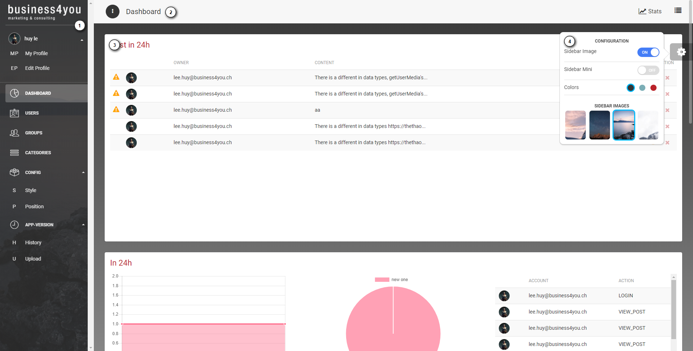
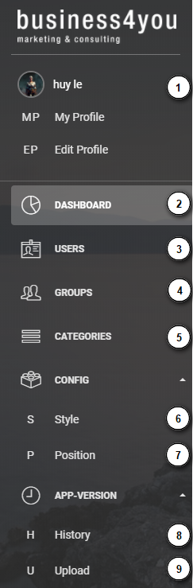
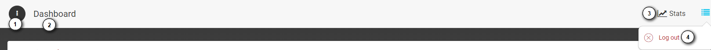
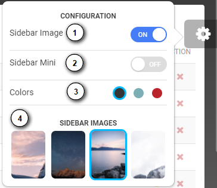

============
Introduction
============

The backend web admin is a website. It can be run on almost common browser, such as Google Chrome, Firefox, Edge. If help the administrator manages all information of the sytem.

User interface basic
----------------------

#.  Side bar

    Side bar is a menu, that contains all functions of the website.

#.  Navigation bar

    It contains the shortcut button and the current view name.

#.  Main view

    Depending on the current view. 

    For instance: when the user access to "Users" the main view will show the user list.

#.  Mini menu

    User can change the website color here.

1. Side bar
-------------------

   1.The logged in user information.
   
   2.The dashboard link.
     
   3.The user management.
     
   4.The group management.
   
   5.The category management.
   
   6.The style management.
   
   7.The position management.
   
   8.The application version history list.
   
   9.The uploading new release for mobile application.
   
2. Navigation bar
-----------------------

    1.The minimum/maximum sidebar button.
    
    2.The current view name.
    
    3.The shortcut to the dashboard.
    
    4.The logout button.

3. Mini menu
-----------------------

    1.Turn on/off image of sidebar.
    
    2.Show minimum/maximum sidebar.
    
    3.Color option of web view.
    
    4.The image of sidebar.
    
