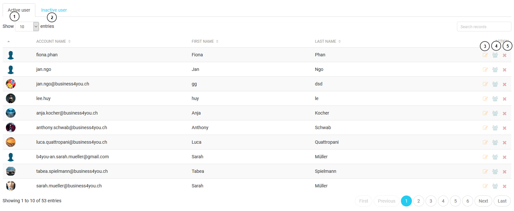
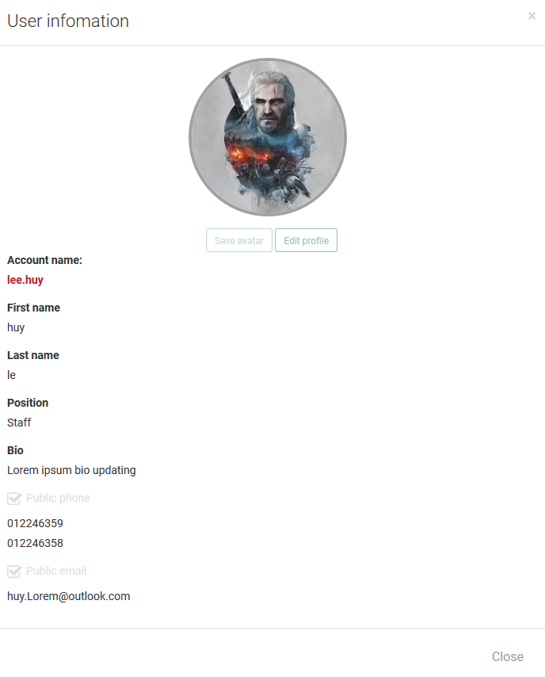
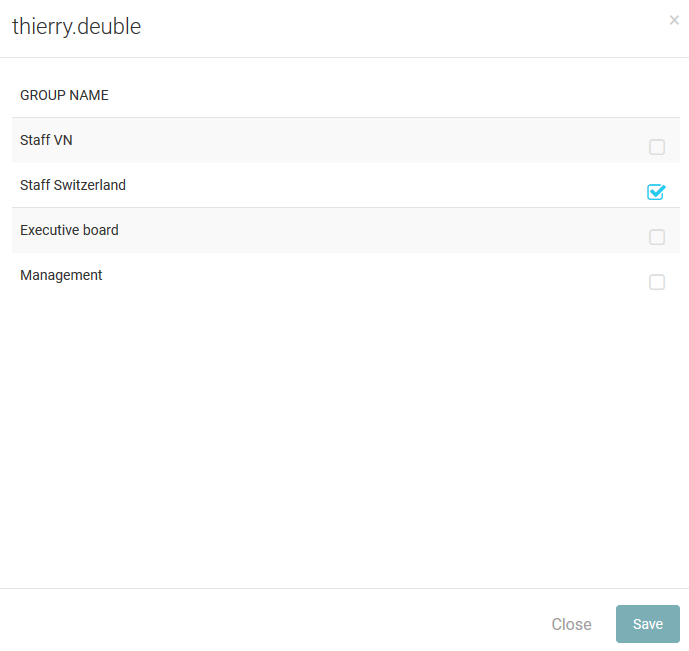

====
User
====

User list
---------------------

This is a list of user of the system. The administrator can view user detail, edit user profile and assign the user to a group or many groups.

#. The list of active users.
#. The list of deactive users who nolonger use application anymnore.
#. View user infomation and edit user form.
#. Assigning group form.
#. Delete button.

1. View and edit user profile.

The overview of user profile.

.. figure:: ../Resources/Images/useredit.png
   :alt: interface_basic
   :scale: 100 %

The editing user profile form, the administrator can change some basic infomation of user.

2. Assigning group

A user have to have agroup. Each group have a specific privilege. So that user have limitaion on the mobile application.